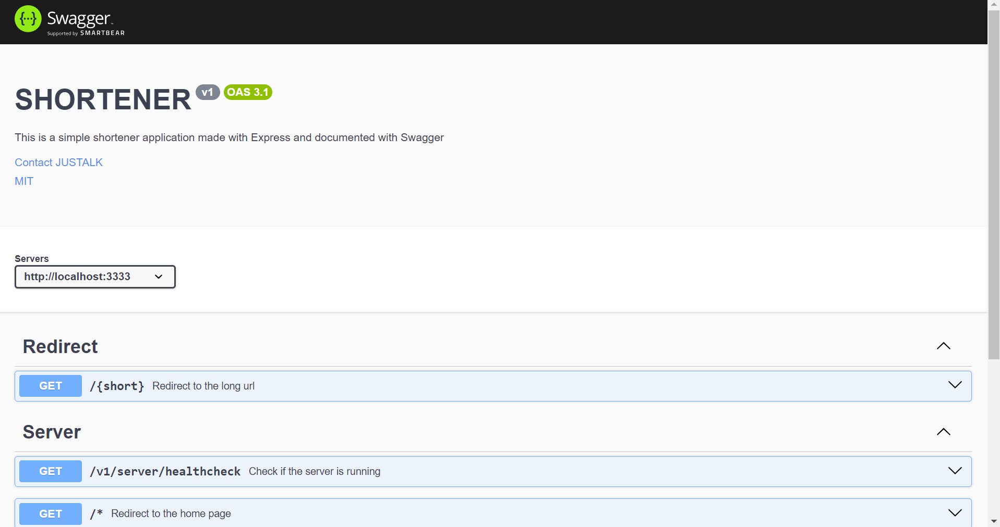
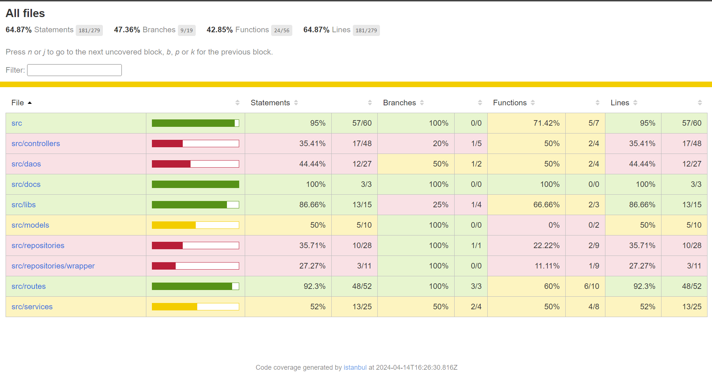
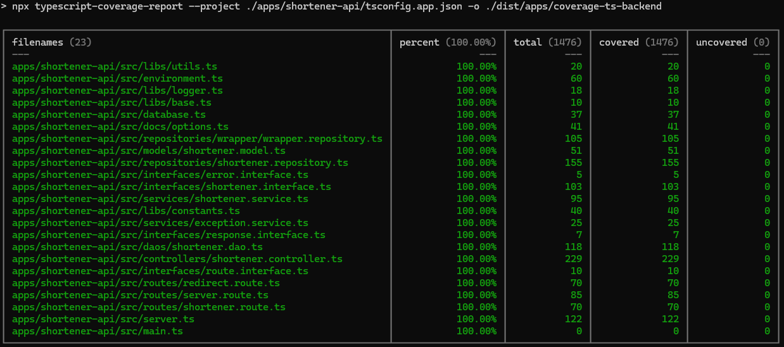
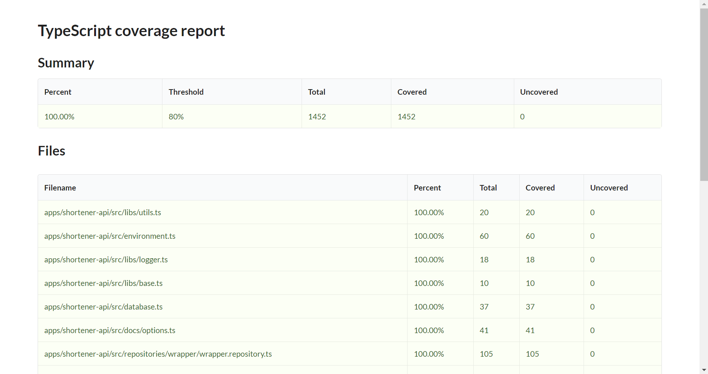

# URL SHORTENER

## Plan of the presentation

I explain with all the details how I build the project and my way of working.

- [Goal](#goal)
- [Plan of the presentation](#plan-of-the-presentation)
- [Prerequisite](#prerequisite)
- [Development](#development)
- [Production](#production)
- [System](#system)
- [Errors](#errors)

## Development

#### Sharing interface between projects

Create a library at the root of the project using NX command:

```bash
$ nx generate @nrwl/js:library types
```

A path pointing to the lib will be added in `tsconfig.base.json`. Since the other tsconfig are extending the tsconfig base, the path will be available in each project.

#### Setting Swagger for api documentation

In order to be able to use swagger, we install the dependencies:

```bash
$ npm i swagger-jsdoc swagger-ui-express --save-dev
```

We then, set up the extensions in `server.ts` and put the options in the folder `docs`:

```js
const specs = swaggerJsdoc(options);
this.#app.use(
     `/${ENVIRONMENT.API.VERSION}/docs`,
     swaggerUi.serve,
     swaggerUi.setup(specs)
);
```

And finally, we put the documentation of the api as close as possible as the api endpoints in `routes`.  
The documentation can be consulted at: [http://localhost:3333/v1/docs](http://localhost:3333/v1/docs)  



#### Setting Jest for unit tests

In order to configure the test on the shortener-api, you need to add a target in the `project.json` of the shortener-api project:

```json
    "test": {
      "executor": "@nx/jest:jest",
      "outputs": ["{workspaceRoot}/dist/apps/coverage-test-backend"],
      "options": {
        "jestConfig": "apps/shortener-api/jest.config.ts",
        "codeCoverage": true,
        "collectCoverageFrom": ["src/**/*.{ts,tsx}"],
        "coverageReporters": [
          "clover",
          "json",
          "lcov",
          "text-summary"
        ],
        "passWithNoTests": true
      }
    }
```

Once done, we also need to modify in ``jest.config.ts`, the `coverageDirectory` in order to move the lcov result in the dist directory in order to be able to access through the express server:

```json
{
     "coverageDirectory": "../../dist/apps/coverage-test-backend",
}
```

Finally, in the express server, we add the route to serve our index as a static resource:

```js
    this.#app.use(
      `/${ENVIRONMENT.API.VERSION}/test/backend`,
      express.static(__dirname + '/../coverage-test-backend/lcov-report')
    );
```

In order to generate the result, run the following command:

```bash
$ nx test shortener-api
# OR
$ npm run test-unit-backend
```

You can then access the result through the url: [http://localhost:3333/v1/test/backend/](http://localhost:3333/v1/test/backend/)

PS: Since we are using the "test" command, the environment variable is "test". The environment file need to be set in consequence.



#### Typescript

###### Backend

For checking my level of coverage of the typing, I am using the package `typescript-coverage-report`.  
The coverage has been push till 100%. Everything has been typed properly.

```bash
$ npm i typescript-coverage-report --save-dev
```

To create the coverage page, simply run the following command:  

```bash
$ npm run ts-coverage-backend
```



If you want more information, the report can be watch through the api once the previous command has been run at least once:

```bash
$ nx server shortener-api
```

You can then look the report at this URL: [http://localhost:3333/v1/typescript/backend/](http://localhost:3333/v1/typescript/backend/)



#### Absolute Path

###### Backend

In order to make absolute path possible, you need to config in the file `tsconfig.json` of each project the following properties:

```json
    "baseUrl": ".",
    "paths": {
      "@controllers/*": [
        "./src/controllers/*"
      ],
    }
```

###### Frontend

For the frontend, it's exactly the same as for the backend with one difference.  
The plugin `vite-tsconfig-paths` need to be install and configure in vite:

```bash
$ npm i -D vite-tsconfig-paths
```

Then in `vite.config.mjs`, just add the plugin:

```js
    plugins: [
      tsconfigPaths(),
    ],
```

Then, it's possible to add the path using the following typo:

```js
import Home from '@pages/Home/Home';
```

## Organization

#### Organization of the project

    .
    ├── .nx                               # Cache NX
    ├── apps                              # Contains all the apps of the project
         └── mongodb                      # The script for setting up the mongodb
         └── shortener                    # The react frontend
                └── locales               # The json file for i18n (multi language)
                └── src                   # The source file
                     └── app              # The app entrance file
                     └── assets           # The asset of the project
                     └── components       # The reusable component
                     └── interfaces       # The interface for typescript
                     └── pages            # The page for the project
                     └── services         # The services for calling the backend
                     └── styles           # The style of the frontend
         └── shortener-api                # The express backend
                └── src                   # The source file
                     └── controllers      # The controllers of the api
                     └── daos             # The data object validating the parameter of the entering request
                     └── docs             # The options for the swagger
                     └── interfaces       # The interface for typescript
                     └── libs             # The libs containing constant, logger and utils
                     └── models           # The model to save in the database
                     └── repositories     # The repository allowing operations to the db
                     └── routes           # The routes allowed by the api
                     └── services         # The services of the backend
         └── shortener-api-e2e            # The tests for the express backend (jest)
         └── shortener-e2e                # The tests for the react frontend (cypress)
    ├── env                               # Environment file
    ├── scenarios                         # The scenario for the load testing
    ├── seeding                           # Seed the database for the test
    ├── nginx                             # Contains the configuration for reverse proxy
    ├── node_modules                      # Contains all the dependencies of the two projects (monorepository)
    ├── .dockerignore                     # The file to ignore for docker
    ├── .eslintrc                         # The configuration for the linter
    ├── .prettierrc                       # The configuration for the prettier
    ├── docker-compose.yml                # File for managing the creation of container for docker
    ├── Dockerfile                        # Creation of container for our apps
    ├── nx.json                           # Setting of nx
    ├── package.json                      # Npm configuration file
    ├── package-lock.json                 # Npm locker version for module
    ├── tsconfig.base.json                # Shared configuration for typescript
    ├── vitest.workspace.json             # Shareed configuration if multiple frontend
    ├── LICENSE                           # Description of the license
    └── README.md                         # Presentation for the project

## Prerequisite

The project where the project will be running need to have the following too:

- Node 20 or Volta
- Npm 10 or higher
- Docker
- Docker Compose
- nx

```bash
$ npm add --global nx@latest
```

## Development

##### Without Docker

In dev mode, the user need to have at least mongoDB setup on his machine
Before starting the development mode without docker
```bash
$ npm install
```

In the terminal, type the following command:

```bash
$ npm run dev
```

##### With Docker

Since the production mode compile the project at every restart and since the project is small.
Without any installation needed, the user can the project using:

```bash
$ npm run up
```

In order to be the closest of possible of the production, modify the `/etc/hosts` with the following:

```bash
127.0.0.1 shortener.net mongodb server1
```

## Production

In the terminal, type the following command:

```bash
$ npm run up
```

#### Limit

- The project does not ensure the unicity of the short url. It means that if the short url unfortunaly has been generated with one already existing,
the url will be replace through an update.

## System

Ubuntu Version: Ubuntu 20.04.1
Node Version: v20.11.1
Npm Version: v10.5.0

The version are manage with [Volta](https://docs.volta.sh/guide/getting-started).

```bash
# Get the latest version of ubuntu
$ lsb_release -a

# Get the version of node
$ node -v

# Get the version of npm
$ npm -v
```

#### Errors

If your computer has not enough memory, in some case, the deamon of NX can fail to start or restart. In such case,  
you can run the following command to clean up the project:

```bash
$ nx reset
```